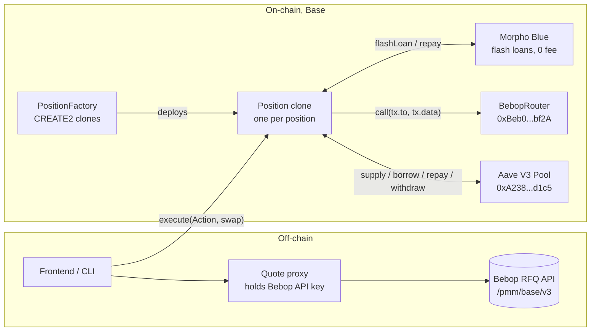
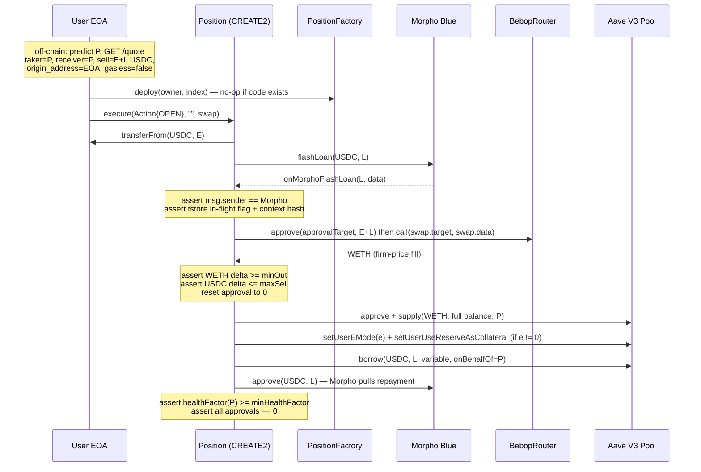
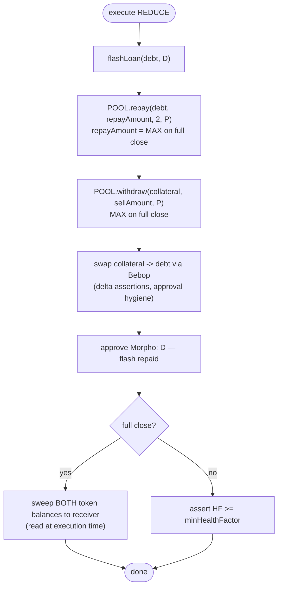
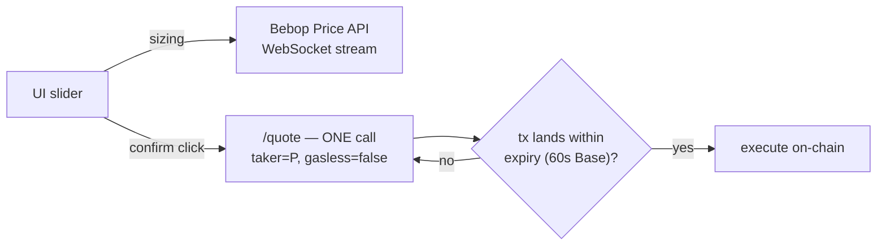
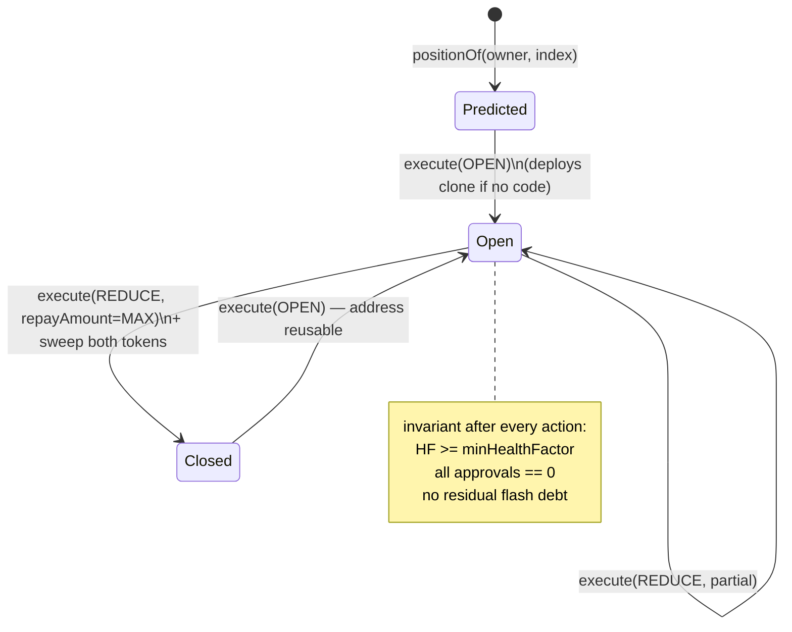
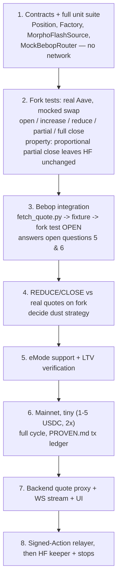

# Implementation Plan — Leveraged Trading on Aave V3 via Bebop RFQ (Base)

Companion to `leverage-bebop-aave-base.md` (the "reference doc"). That file holds the
verified facts and rationale; this file holds **what we build, in what order, and how
each piece connects**. Chain: Base (8453).

---

## 1. System overview

Four Solidity contracts, one Foundry test harness, one quote-fetch script, and (later)
a thin backend proxy. Nothing else.



Key decisions (all argued in the reference doc, restated here as commitments):

| Decision | Choice |
|---|---|
| Execution venue | Bebop **RFQ self-execution** (`gasless=false`) — firm price, no taker signature, we are `msg.sender` |
| Position account | **Minimal CREATE2 clone** (not Safe) — ~45k gas, no module/1271 plumbing |
| Flash source | **Morpho Blue** (zero fee, so borrow == flash exactly); Aave Pool behind the same `IFlashSource` interface as fallback |
| Debt token | Native USDC `0x8335...2913`; collateral WETH first, then wstETH/cbETH/weETH |
| v1 auth | `msg.sender == owner`; entrypoints already take `(Action, sig, SwapCall)` so gasless is a drop-in later |
| Swap safety | Target allow-list + exact-amount approval reset to 0 + **balance-delta assertions** (never trust return values) |

---

## 2. Repo layout

```
contracts/
  src/
    PositionFactory.sol      # CREATE2 clone factory, positionOf(owner, index)
    Position.sol             # open / increase / reduce-close, flash callback, all guards
    flash/
      IFlashSource.sol
      MorphoFlashSource.sol
      AaveFlashSource.sol    # fallback, reads FLASHLOAN_PREMIUM_TOTAL on-chain
  test/
    Position.t.sol           # layer 1: unit, MockBebopRouter + MockFlashSource
    mocks/
      MockBebopRouter.sol    # fixed-rate swap
      MockFlashSource.sol
    fork/
      AaveFork.t.sol         # layer 2: real Aave, mocked swap
      BebopFork.t.sol        # layer 3: real Aave + real Bebop fixture
    fixtures/
      quote-open.json        # written by scripts/fetch-quote.py
scripts/
  fetch_quote.py             # extends existing bebop.py: predicted-taker quote -> fixture
bebop.py                     # existing client, reused (add taker/origin/gasless params)
PROVEN.md                    # mainnet tx-hash ledger, one line per proven action
```

Reuse note: `bebop.py` already does authenticated PMM quotes. `fetch_quote.py` only adds
`receiver_address`, `origin_address`, `origin_target`, `gasless=false`, and writes the
JSON fixture. No new HTTP client.

---

## 3. Core data structure

Every state-changing entrypoint takes this from day one (reference doc §6) so gasless
relaying later changes zero storage or flow:

```solidity
struct Action {
    address position;
    uint256 nonce;
    uint256 deadline;
    uint8   mode;                // OPEN | INCREASE | REDUCE
    address collateral;
    address debt;
    uint256 equity;              // OPEN only
    uint256 maxSell;             // hard cap on swap input
    uint256 minOut;              // hard floor on swap output (= quote's buy amount)
    uint256 flash;
    uint256 repayAmount;         // REDUCE; type(uint256).max = full close
    uint256 minHealthFactor;
    address receiver;
    uint256 triggerHealthFactor; // 0 = none (stops are v2)
}

struct SwapCall {
    address target;              // must be BebopRouter or BebopSettlement (immutable allow-list)
    address approvalTarget;      // from the quote response
    bytes   data;                // quote's tx.data, opaque
}

function execute(Action calldata a, bytes calldata sig, SwapCall calldata swap) external;
```

The signature (v2) binds **economic bounds, not calldata** — `maxSell`, `minOut`,
`minHealthFactor`, `deadline`, `receiver`, token pair. The relayer's only freedom is
price improvement. This is deliberate and gets a comment block in the contract.

---

## 4. Flows

### 4.1 Open (leveraged long)

Off-chain sizing: `E` = user equity in debt token, `X` = leverage (1e4 fp).
`L = E*(X-1e4)/1e4` (flash), swap size `S = E + L`. Morpho fee = 0, so borrow `= L` exactly.



Ordering rules baked in: supply full **realized** balance (never the quoted minimum);
eMode entered **after** supply, **before** borrow; borrow executed **by P itself**
(credit delegation makes router-centric designs impossible).

### 4.2 Reduce / partial close / full close (one mode)



Debt-first ordering inside the flash window is mandatory: Aave's LTV check must never
see an invalid intermediate state. Sizing is *better* than the CoW version: an exactIn
RFQ quote gives the debt-token output exactly, so `D` is precise — or use `buy_amounts`
(exactOut) for exactly `D` and let leftover collateral fall out as residual.

Full-close dust (aToken + vDebt grow every block): **v1 strategy = quote slightly under
the current aToken balance, sell that, sweep the collateral remainder.** The two fancier
options (`exactAmount == 0` router mode, `partialFillOffset` patching) are open
questions 6 in the reference doc — decide in build step 4, on a fork, not now.

### 4.3 Increase leverage

No flash needed — borrow first, capped by Aave's `availableBorrows`:

```
borrow(debt, extra, 2, 0, P) -> Bebop swap debt->collateral -> supply(full balance) -> assert HF
```

### 4.4 Quote lifecycle (off-chain)



Integrator rules enforced by construction: stream for sizing, `/quote` only at
execution, never cache-and-execute-later, one quote per fill, `origin_*` fields always
sent, API key server-side only (backend proxy, step 7).

---

## 5. Position state machine



---

## 6. Security checklist (implemented as code, not docs)

Every item below is a `require`/`assert` or an immutable, and each gets a dedicated
unit test:

1. `swap.target ∈ {BEBOP_ROUTER, BEBOP_SETTLEMENT}` — immutable allow-list.
2. Approve `approvalTarget` for exactly `maxSell`; reset to 0 after; assert 0.
3. Balance-delta verification: `sellSpent <= maxSell`, `buyReceived >= minOut`.
4. No delegatecall anywhere near caller-influenced data.
5. Flash callback: transient-storage in-flight flag + `msg.sender == flashSource`
   + context-hash re-check (`tstore` keccak of params before, compare in callback —
   Morpho has no initiator field, the flag does real work).
6. `deadline` and live `minHealthFactor` (from `getUserAccountData`, handle
   `type(uint256).max` when debt-free) as postconditions on every action.
7. Only `owner` may call (v1); nonce consumed either way so v2 replay-safety is free.

---

## 7. Build order (mirrors reference doc §11 — do not reorder)



Steps 1–2 are where the bugs live: every non-trivial bug in the CoW POC was an **Aave
semantics** bug (base-LTV-0 collateral not auto-enabled, premium rounding, stranded
positive slippage, interest-accrual dust) — not a venue bug. Step 2 is not skippable.

### Per-step deliverables

| Step | Done when |
|---|---|
| 1 | `forge test` green: math, HF guards, delta asserts, reentrancy, approval hygiene, MAX semantics, residual sweep |
| 2 | Anvil fork of Base: all five actions pass against real Pool; HF-invariance property test passes |
| 3 | Live demo-mode quote for a **predicted** position address executes on a fork (fork-then-fetch-then-run, no `vm.warp` past expiry); confirmed whether `swap` requires `msg.sender == taker_address` |
| 4 | Full close with real quote; dust strategy chosen and tested |
| 5 | eMode 1 verified for WETH-correlated pairs; correct category for WETH/USDC confirmed |
| 6 | `PROVEN.md` has a Basescan tx hash for open, increase, reduce, full close |
| 7 | Frontend never touches `api.bebop.xyz`; slider driven by the WS stream |
| 8 | EIP-712 `Action` signatures (OZ `ECDSA`, chainId + verifyingContract + position bound), relayer executes; keeper fires `triggerHealthFactor` stops with `requireHFBelow` first on-chain |

---

## 8. Testing matrix

| Layer | Network | Swap | Flash | Proves |
|---|---|---|---|---|
| 1 unit | none | MockBebopRouter | MockFlashSource | arithmetic, guards, hygiene |
| 2 fork | anvil fork Base | mock | real Morpho | every Aave semantic |
| 3 fork+quote | anvil fork Base | **real Bebop fixture** | real Morpho | the integration; questions 5 & 6 |
| 4 mainnet | Base | real | real | end-to-end, cents of gas |

Layer-3 fixture constraints (all four must hold): don't warp past `expiry`; fork at/near
latest so the maker has balance+approval; fresh fork keeps `maker_nonce` unconsumed;
quote requested for the predicted `P` and executed from `P`.

---

## 9. Blocked-on-external (do these conversations early)

From reference doc §10 — none block steps 1–2, all block step 6:

- **[ASK Bebop]** register Position impl + factory as contract takers; confirm
  `origin_address` requirement; rate limits per key/chain; whether `expiry_type=short`
  (3s) works for keeper stops.
- **[verify on fork, step 3]** `msg.sender == taker_address` requirement;
  `exactAmount == 0` reachability; current `FLASHLOAN_PREMIUM_TOTAL()`; real gas cost
  incl. L1 data component.

---

## 10. Explicitly out of scope for v1

- JAM / Aggregation API (reintroduces async third-party execution)
- BopAMM (closed beta)
- Safe-based positions (revisit only if manual-recovery-via-Safe-UI becomes a product requirement)
- Gasless execution, relayer, stop-loss keeper (v2 — but the `Action` struct and nonce
  are shaped for them from day one)
- Permit2 equity pull (gasless-mode only on Bebop; plain `approve`/`permit` for v1)
